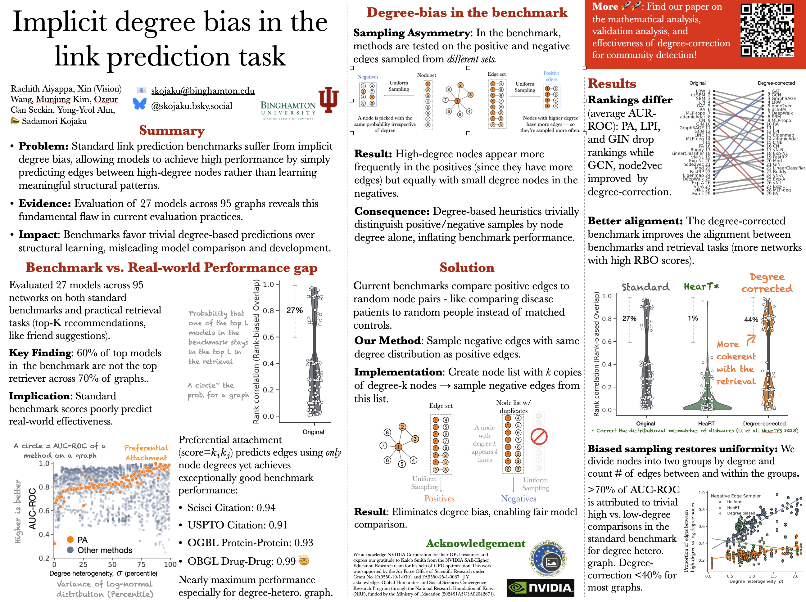

# Degree-corrected link prediction task




## Table of content

- [Degree-corrected link prediction task](#degree-corrected-link-prediction-task)
  - [Installation](#installation)
  - [Usage](#usage)
- [Running your link prediction benchmarks](#running-your-link-prediction-benchmarks)
- [Reproducing the results](#reproducing-the-results)


## Citation

```
@inproceedings{aiyappa2025implicit,
title={Implicit degree bias in the link prediction task},
author={Rachith Aiyappa and Xin Wang and Munjung Kim and Ozgur Can Seckin and Yong-Yeol Ahn and Sadamori Kojaku},
booktitle={Forty-second International Conference on Machine Learning},
year={2025},
url={https://openreview.net/forum?id=gJ7cU9cdZB}
}
```

This repository provides the code to generate the degree-corrected link prediction task.
## Installation
```bash
pip install "git+https://git@github.com/skojaku/degree-corrected-link-prediction.git#subdirectory=libs/dclinkpred&egg=dclinkpred"
```
or
```bash
git clone https://github.com/skojaku/degree-corrected-link-prediction.git
cd degree-corrected-link-prediction/libs/dclinkpred
pip install -e .
```

## Usage

The `LinkPredictionDataset` class takes a network as input and returns a training network and a set of test edges. The network can be of type `networkx.Graph`, `scipy.sparse.csr_matrix`, or `numpy.ndarray`. For efficiency, we recommend using the `scipy.sparse.csr_matrix` format.

```python
from dclinkpred import LinkPredictionDataset
import networkx as nx
from scipy import sparse
import numpy as np

# --- Example with networkx.Graph ---
# Create a karate club graph
G_nx = nx.karate_club_graph()
lpdata_nx = LinkPredictionDataset(testEdgeFraction=0.2, degree_correction=True)
lpdata_nx.fit(G_nx)
train_net_nx, src_test_nx, trg_test_nx, y_test_nx = lpdata_nx.transform()

# --- Example with scipy.sparse.csr_matrix ---
# Create a sparse matrix
G_sparse = sparse.csr_matrix([[0, 1, 1], [1, 0, 0], [1, 0, 0]])
lpdata_sparse = LinkPredictionDataset(testEdgeFraction=0.2, degree_correction=True)
lpdata_sparse.fit(G_sparse)
train_net_sparse, src_test_sparse, trg_test_sparse, y_test_sparse = lpdata_sparse.transform()

# --- Example with numpy.ndarray ---
# Create a numpy array
G_numpy = np.array([[0, 1, 1], [1, 0, 0], [1, 0, 0]])
lpdata_numpy = LinkPredictionDataset(testEdgeFraction=0.2, degree_correction=True)
lpdata_numpy.fit(G_numpy)
train_net_numpy, src_test_numpy, trg_test_numpy, y_test_numpy = lpdata_numpy.transform()


# --- Detailed usage ---
G = nx.karate_club_graph()
G = nx.adjacency_matrix(G) # For efficiency

lpdata = LinkPredictionDataset(
    testEdgeFraction=0.2, # 20% of the edges will be used for testing
    degree_correction=True, # degree correction will be applied
    negatives_per_positive=10, # 10 negative samples will be generated for each positive sample
    allow_duplicatd_negatives=False, # Do not allow duplicate negative edges
)
lpdata.fit(G) # Fit the dataset
train_net, src_test, trg_test, y_test = lpdata.transform() # Transform the dataset

train_net # The network for training
src_test # The source nodes of the test edges
trg_test # The destination nodes of the test edges
y_test # The labels of the test edges, where 1 means positive and 0 means negative
```

We provide all source code and data to reproduce the results in the paper. For detailed instructions, please see [docs/REPRODUCIBILITY.md](docs/REPRODUCIBILITY.md).
